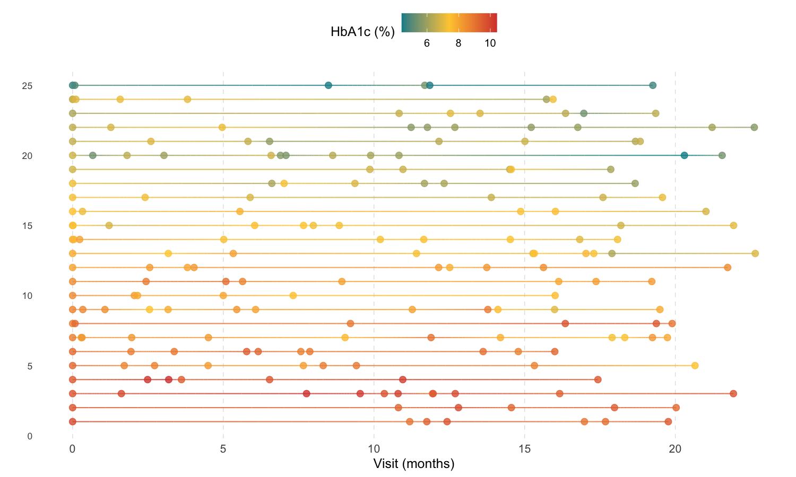
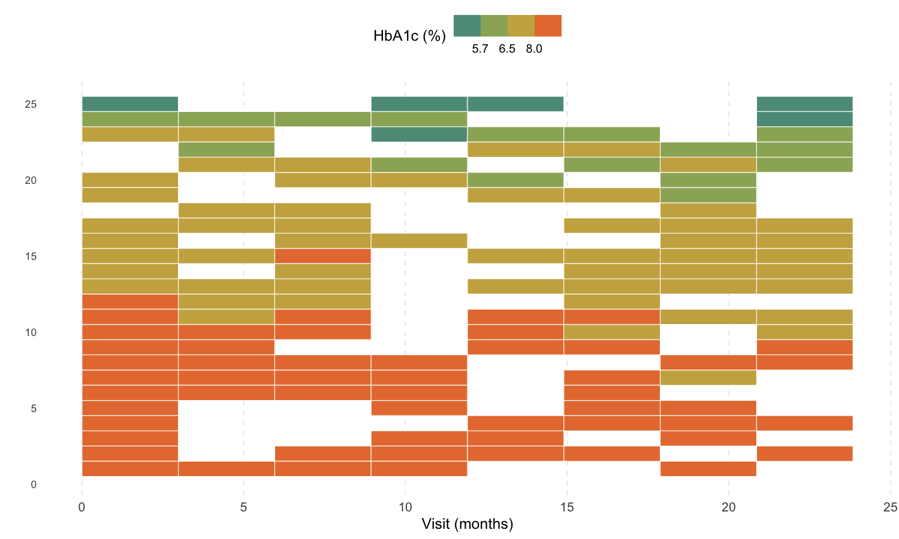
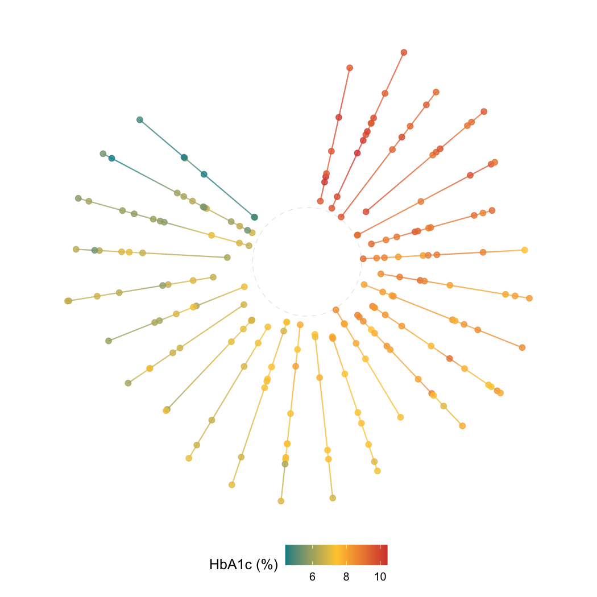
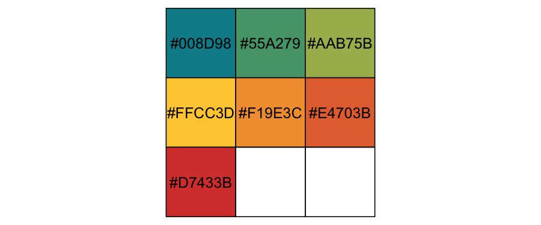

# ggkodom

**ggkodom** is a ggplot2 extension for visualizing individual-level
longitudinal trajectories. Each subject gets its own visual lane;
measurements are encoded as a smooth color gradient. Three layout geoms
cover different analytical needs:

| Geom | Best for |
|----|----|
| [`geom_kodom_line()`](reference/geom_kodom_line.md) | Irregular visit schedules; visible per-observation timing |
| [`geom_kodom_heatmap()`](reference/geom_kodom_heatmap.md) | Large cohorts; aligned time-window summaries |
| [`geom_kodom_circular()`](reference/geom_kodom_circular.md) | Compact population overview; the Kadam-flower aesthetic |

The package is named after the Kadam flower (*Neolamarckia cadamba*),
whose radial spoke structure inspired the circular layout.

## Installation

``` r

# install.packages("devtools")
devtools::install_github("subroy13/ggkodom")
```

## Quick start

``` r

library(ggkodom)
#> কদম গাছে উঠিয়া আছে গোলমেলে ডেটা
#> প্লট বানিয়ে সোজা করবে ggkodom-এর ব্যাটা!
#> 
#> (English Translation: Messy data has climbed the Kodom tree, but ggkodom's lad will straighten it out with a plot!)
#> Welcome to ggkodom! 
#> Version: 0.1.0
library(ggplot2)
#> Warning: package 'ggplot2' was built under R version 4.5.2

set.seed(42)
n_subjects <- 25
n_obs_per <- sample(6:12, n_subjects, replace = TRUE)

df <- do.call(rbind, lapply(seq_len(n_subjects), function(i) {
  n <- n_obs_per[i]
  base <- rnorm(1, mean = 7.5, sd = 1.2)
  trend <- rnorm(1, mean = -0.02, sd = 0.01)
  time <- sort(runif(n, 0, 24))
  data.frame(
    subject_id = sprintf("P%03d", i),
    visit_month = time,
    relative_month = time - min(time),
    hba1c = pmax(4, base + trend * time + rnorm(n, sd = 0.4)),
    arm = ifelse(i <= 12, "Treatment", "Control"),
    stringsAsFactors = FALSE
  )
}))
```

### Line plot

``` r

ggplot(df, aes(x = relative_month, id = subject_id, colour = hba1c)) +
  geom_kodom_line(sort_by = "first") +
  scale_colour_kodom(name = "HbA1c (%)") +
  labs(x = "Visit (months)", y = "") +
  theme_kodom()
```



### Heatmap

``` r

ggplot(df, aes(x = visit_month, id = subject_id, fill = hba1c)) +
  geom_kodom_heatmap(bins = 8, sort_by = "mean") +
  scale_fill_kodom(
    discretize   = TRUE,
    color_breaks = c(5.7, 6.5, 8),
    name         = "HbA1c (%)"
  ) +
  labs(x = "Visit (months)", y = "") +
  theme_kodom()
```



### Circular

``` r

ggplot(df, aes(x = visit_month, id = subject_id, colour = hba1c)) +
  geom_kodom_circular(sort_by = "mean", show_points = TRUE) +
  scale_colour_kodom(name = "HbA1c (%)") +
  coord_fixed() +
  theme_kodom_circular() +
  labs(title = "")
```



## Key aesthetics

All three geoms share the same aesthetic contract:

- **`x`** — time variable
- **`id`** — subject identifier (stat converts it to integer lane
  positions)
- `colour` / `fill` — measured value; drives the colour gradient and
  lane sorting
- `size` → point markers only (`geom_kodom_line` /
  `geom_kodom_circular`)
- `linewidth` → connecting path only
- `alpha`, `shape`, `stroke`, `linetype` — standard ggplot2 semantics

Because all geoms are native ggplot2 layers, they compose freely with
[`facet_wrap()`](https://ggplot2.tidyverse.org/reference/facet_wrap.html),
`scale_*()`,
[`theme()`](https://ggplot2.tidyverse.org/reference/theme.html), and
`coord_*()`.

## Colour palette

``` r

scales::show_col(kodom_colors(7))
```



Three anchors — teal `#008D98`, gold `#FFCC3D`, red `#D7433B` —
interpolated via `colorRampPalette`. Pass `discretize = TRUE` and
`color_breaks` to switch to solid clinical bands.

## Learn more

- [`vignette("kodom-lines")`](articles/kodom-lines.md) — full feature
  tour of [`geom_kodom_line()`](reference/geom_kodom_line.md): point
  shapes, independent `size`/`linewidth`, covariate encoding, faceting
- `vignette("kodom-variants")` —
  [`geom_kodom_heatmap()`](reference/geom_kodom_heatmap.md) and
  [`geom_kodom_circular()`](reference/geom_kodom_circular.md) in depth:
  bin resolution, aggregation functions, gap/inner fractions,
  large-cohort use cases

## Authors

Ayoushman Bhattacharya, Sayan Das, Subrata Pal, Subhrajyoty Roy.
Developed as part of the WashU Datathon 2026.

## License

[MIT](LICENSE.md)
